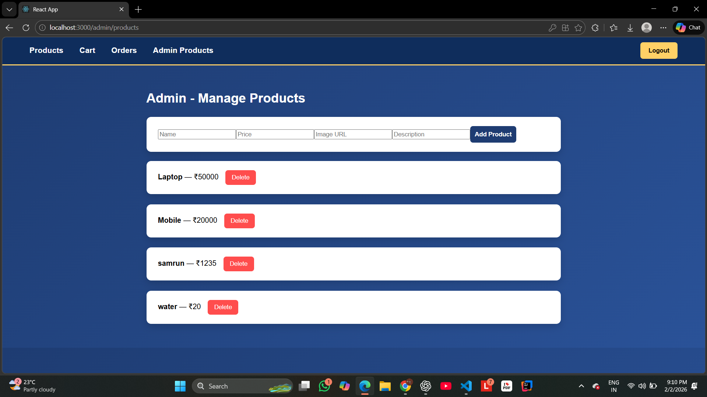

# 🛒 E-Commerce Store (MERN Stack)

A full-fledged E-Commerce web application built using **MongoDB, Express, React, Node.js** with **JWT Authentication**, **Cart**, **Orders**, and **Admin Dashboard**.

🔗 **Live Backend (Render):**  
https://ecommerce-store-zks8.onrender.com

---

## 🚀 Features

### 👤 User
- Register & Login (JWT Auth)
- View Products
- Add to Cart
- Remove from Cart
- Place Order
- Cancel / Remove Order

### 🛠 Admin
- Add Product
- Delete Product
- View All Orders
- Update Order Status (Shipped / Delivered)

---

## 🧱 Tech Stack

| Frontend | Backend | Database | Auth | Deployment |
|----------|---------|----------|------|------------|
| React    | Node.js | MongoDB Atlas | JWT | Render |

---

## 📸 Screenshots

### 🔐 Login Page


### 🛍 Products Page


### 🛒 Cart Page


### 📦 Orders Page


### 🛠 Admin Dashboard


---

## ⚙️ Setup Instructions

### 1️⃣ Clone Repo
```bash
git clone https://github.com/nagesh7721/ecommerce-store.git
```

### 2️⃣ Backend Setup
```bash
cd server
npm install
npm start
```

### 3️⃣ Frontend Setup
```bash
cd client
npm install
npm start
```

---

## 🌍 Environment Variables (.env)

```
MONGO_URI=your_mongodb_atlas_url
JWT_SECRET=your_secret
```

---

## 📌 Project Highlights
- Proper MVC Structure
- Role Based Authorization (Admin/User)
- Real-time Cart → Order flow
- Production Deployment on Render
- MongoDB Atlas Cloud Database

---

## 👨‍💻 Developed By
**Nagesh Chonde**
