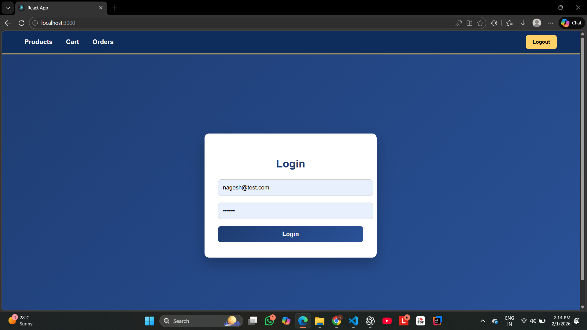
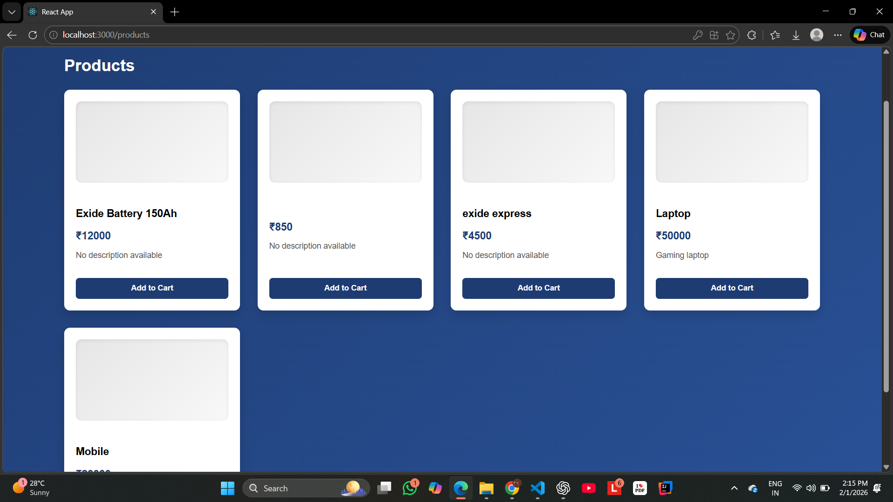
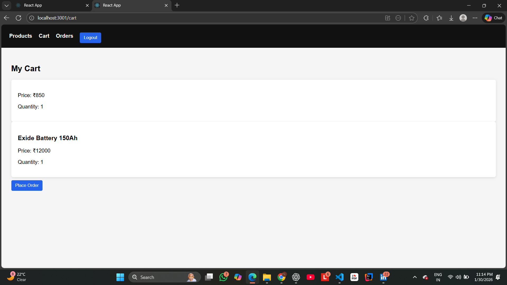
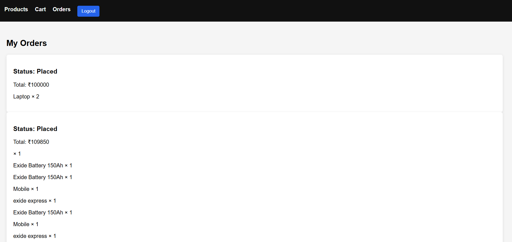

🛒 E-Commerce Store — MERN Stack

A full-stack E-Commerce web application where users can browse products, manage cart, and place orders with secure authentication. Includes an admin flow to manage products from the database.

🔧 Tech Stack

Frontend
React.js
Tailwind CSS
Axios
React Router DOM

Backend
Node.js
Express.js
MongoDB
JWT Authentication
REST APIs

✨ Core Features
User
Register / Login (JWT)
View products
Add to cart
Place orders
Responsive UI

Admin
Add products
Update products
Delete products
Manage product data from MongoDB

ecommerce-store/
│
├── client/     → React Frontend
├── server/     → Node + Express Backend
└── README.md

git clone https://github.com/nagesh7721/ecommerce-store.git
cd ecommerce-store

cd server
npm install

MONGO_URI=your_mongodb_connection_string
JWT_SECRET=your_secret_key
PORT=5000

npm start

cd client
npm install
npm start
App runs on: http://localhost:3000

## Screenshots

### Login

### Products

### Cart

### Orders

Learning Outcomes
Complete MERN project structure
JWT Authentication
REST API integration
MongoDB database handling
React state management

👨‍💻 Author : Nagesh Chonde,BSc Computer Science,GitHub: https://github.com/nagesh7721

🚀 Future Improvements
Payment Gateway Integration
Order History
Product Search & Filters
Admin Dashboard UI